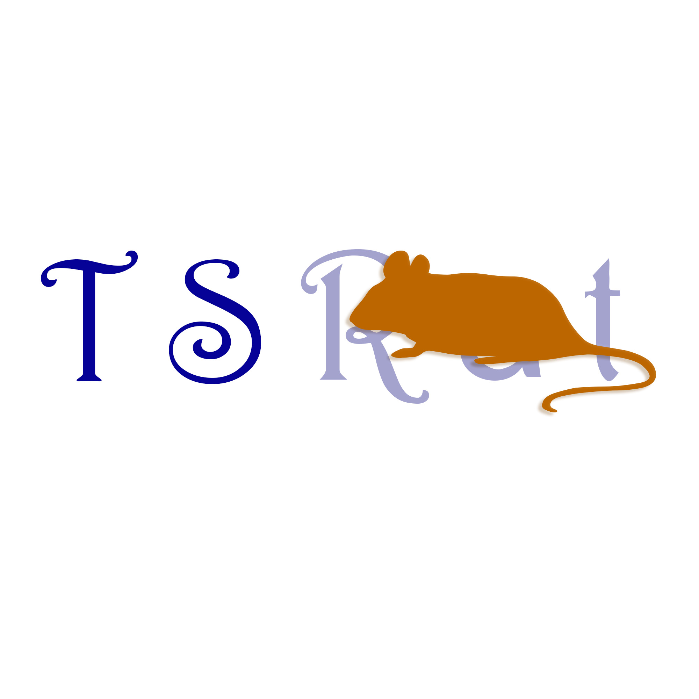

# TSRat（TS鼠）的网站档案馆

<p align="center">
  
</p>

这是 TSRat（TS鼠）的集中式网站仓库。它把人物专题、思想简报与创作型故事档案保存在同一个 Git 仓库中，再通过同一套 GitHub Actions workflow 发布到 GitHub Pages 的不同子目录。

采用集中式仓库的目的，是共享版本历史、部署入口与总导航，同时让每个网站继续拥有独立 URL、内容原则和视觉语言。新增文档体系用于让新的 AI Coding Agent 在没有聊天记录的情况下安全接管；它不代表现有项目已经被重构成统一框架。

## 公开入口

- 总入口：[TSRat Website Archive](https://tsrat.github.io/My-Website/)
- 仓库：[TSRat/My-Website](https://github.com/TSRat/My-Website)

## 当前项目

| 项目 | 用途 | 主要维护位置 | GitHub Pages URL | 审核分级 | 迁移 / 审查状态 |
| --- | --- | --- | --- | --- | --- |
| The Living Atlas | 总入口主站，一个人的开放档案馆 | `sites/living-atlas/`；`THE-LIVING-ATLAS/` 是构建镜像 | [The Living Atlas](https://tsrat.github.io/My-Website/THE-LIVING-ATLAS/) | REFACTOR | 内容系统通过 [PR #13](https://github.com/TSRat/My-Website/pull/13) 合并；Data / starter 与 Worlds 含混性修正通过 [PR #14](https://github.com/TSRat/My-Website/pull/14) 合并 |
| IVORY ARCHIVE | 每期 5 则的中文思想简报，覆盖艺术人文、社会科学与女性主义 | `sites/ivory-archive/`；`app/` 是 Vinext 路由适配器，`public/` 是框架资源根 | [IVORY ARCHIVE](https://tsrat.github.io/My-Website/IVORY-ARCHIVE/) | PRESERVE | 六阶段迁移已通过 [PR #15](https://github.com/TSRat/My-Website/pull/15) 合并：双渲染 parity、manifest、Data 入口与 provider-neutral events |
| Enheduanna / 恩赫杜安娜 | “时间的女儿 004”人物专题；公主、祭司、作者与先驱 | `sites/enheduanna/`；`npm run build:enheduanna` 更新 `ENHEDUANNA/` Pages 镜像 | [恩赫杜安娜：第一人](https://tsrat.github.io/My-Website/ENHEDUANNA/) | REFACTOR | 六阶段可维护重建与 Data 入口已通过 [PR #17](https://github.com/TSRat/My-Website/pull/17) 合并 |
| La Malinche / 马琳切 | “时间的女儿 003”人物专题；翻译、征服、幸存与被制造的背叛 | `sites/la-malinche/`；`npm run build:malinche` 更新 `LA-MALINCHE/` Pages 镜像 | [马琳切：谁背叛了背叛者？](https://tsrat.github.io/My-Website/LA-MALINCHE/) | REBUILD | 30 屏差异化视觉叙事、双片放映与评审预览由当前 PR 交付 |
| Hildegard / 希尔德加德 | “时间的女儿 002”人物专题；女院长、先知、学者、音乐家与语言发明者 | `sites/hildegard/`；`HILDEGARD/` 是构建镜像 | [谦卑的反叛者：宾根的希尔德加德](https://tsrat.github.io/My-Website/HILDEGARD/) | PRESERVE | 六阶段实现已通过 [PR #16](https://github.com/TSRat/My-Website/pull/16) 合并 |
| Hypatia / 希帕蒂娅 | “时间的女儿 001”人物专题；教师、哲学家与公共人物 | `sites/hypatia/`；`HYPATIA/` 是构建镜像 | [教师之死：希帕蒂娅](https://tsrat.github.io/My-Website/HYPATIA/) | REFACTOR | 六阶段实现已通过 [PR #16](https://github.com/TSRat/My-Website/pull/16) 合并 |
| Sartre / 《恶心》导读 | 面向初读者的互动阅读导览，连接故事、人物、偶然性与阅读实验 | `sites/sartre-nausea-guide/`；`SARTRE-NAUSEA-GUIDE/` 是构建镜像 | [《恶心》：存在为何令人眩晕](https://tsrat.github.io/My-Website/SARTRE-NAUSEA-GUIDE/) | REFACTOR | 六阶段迁移由 [PR #19](https://github.com/TSRat/My-Website/pull/19) 交付 |
| Existentialism / 《存在主义是一种人道主义》导读 | 面向初学者的讲演论证地图，保留自由、责任、行动与争议 | `sites/existentialism-humanism-guide/`；`EXISTENTIALISM-HUMANISM-GUIDE/` 是构建镜像 | [存在主义是一种人道主义](https://tsrat.github.io/My-Website/EXISTENTIALISM-HUMANISM-GUIDE/) | PRESERVE | 六阶段迁移由 [PR #19](https://github.com/TSRat/My-Website/pull/19) 交付 |
| Melromarc Sisters | Malty 与 Melty 的非官方多重故事档案 | `sites/melromarc-sisters/`；`MELROMARC-SISTERS/` 是构建镜像 | [Melromarc 姐妹故事](https://tsrat.github.io/My-Website/MELROMARC-SISTERS/) | REBUILD | 可维护重建与 Data 入口已通过 [PR #18](https://github.com/TSRat/My-Website/pull/18) 合并 |
| 张勇的生活切片 | 围绕身份、身体、照料、关系、阅读与日常恢复的开放人物档案 | `sites/zhangyong-portrait/`；`ZHANGYONG-PORTRAIT/` 是构建镜像 | [张勇的生活切片](https://tsrat.github.io/My-Website/ZHANGYONG-PORTRAIT/) | PRESERVE | 静态模块迁移已通过 [PR #21](https://github.com/TSRat/My-Website/pull/21) 合并 |
| 两只天鹅：Malty 与 Melty | 十一章互动视觉小说；姐妹关系、责任、追责与重新连接 | `sites/malty-melty-childhood/`；`MALTY-MELTY-CHILDHOOD/` 是构建镜像 | [两只天鹅](https://tsrat.github.io/My-Website/MALTY-MELTY-CHILDHOOD/) | REFACTOR | 静态模块迁移已通过 [PR #21](https://github.com/TSRat/My-Website/pull/21) 合并 |

组合级详细审计见 [`web/portfolio-audit.md`](./web/portfolio-audit.md)，六阶段平台标准见 [`web/platform-standard.md`](./web/platform-standard.md)。共享 Figma 设计源为 [TSRat Web Design System · Portfolio Normalization](https://www.figma.com/design/ey07N2cwgxCtNUjvm6Ixgt)。

### 真实来源与静态快照

- `IVORY-ARCHIVE/` 是已提交的历史静态快照，最后一次目录级更新停在第 02 期。当前 GitHub Pages 版本由 `sites/ivory-archive/briefings.ts` 和 `public/` 在 Actions 中重新生成；不要把旧快照当作主要内容源。
- 所有十一个网站的维护入口统一位于 `sites/<site-id>/`。每个站点包都包含 `site.config.json`、`CONTENT.md`、`DESIGN.md`、`TECH.md`、`HANDOFF.md` 与站点特定源码。
- The Living Atlas、Hypatia 和 Hildegard 使用直接静态源码，通过共享站点构建器更新各自大写 Pages 镜像。
- Enheduanna 与 Melromarc 使用 React/TypeScript/Vite；共享构建器先生成 `.site-build/`，再更新大写镜像，并保留未被新入口引用的旧 bundle 作为回滚材料。
- 两个哲学导读保留独立 Next.js 源码；共享构建器通过静态导出与相对路径重写更新大写镜像。
- IVORY 的内容、组件和项目文档位于 `sites/ivory-archive/`；Next/Vinext 所需的根 `app/` 只保留路由适配器，`public/` 继续作为框架要求的资源根。

修改任何站点前，先阅读该项目的 `CONTENT.md`、`DESIGN.md`、`TECH.md` 和 `HANDOFF.md`。

## 仓库结构

```text
My-Website/
├── README.md
├── AGENTS.md
├── TECH.md
├── HANDOFF.md
├── web/                         # 组合级网站审计与平台标准（受版本控制的源文档）
├── .github/workflows/publish-static-mirror.yml
├── sites/                       # 十一个网站统一的权威维护目录
│   ├── living-atlas/
│   ├── ivory-archive/
│   ├── enheduanna/
│   ├── la-malinche/
│   ├── hildegard/
│   ├── hypatia/
│   ├── sartre-nausea-guide/
│   ├── existentialism-humanism-guide/
│   ├── melromarc-sisters/
│   ├── zhangyong-portrait/
│   └── malty-melty-childhood/
├── app/                         # IVORY ARCHIVE 的 Vinext 路由适配器
├── public/                      # IVORY ARCHIVE 的图片和公共资源
├── scripts/                     # Pages 生成、构建与验证脚本
├── ENHEDUANNA/                  # Enheduanna 当前发布镜像
├── LA-MALINCHE/                 # La Malinche 当前发布镜像
├── HYPATIA/                     # Hypatia 当前发布镜像
├── HILDEGARD/                   # Hildegard 当前发布镜像
├── SARTRE-NAUSEA-GUIDE/         # Sartre 当前发布镜像
├── EXISTENTIALISM-HUMANISM-GUIDE/ # Existentialism 当前发布镜像
├── MELROMARC-SISTERS/           # Melromarc 当前发布镜像
├── THE-LIVING-ATLAS/            # Living Atlas 当前发布镜像
├── ZHANGYONG-PORTRAIT/          # 张勇的生活切片当前发布镜像
├── MALTY-MELTY-CHILDHOOD/       # 两只天鹅当前发布镜像
├── IVORY-ARCHIVE/               # IVORY 的旧静态快照，不是当前 Pages 来源
└── tests/                       # 当前应用构建后的 Node 测试
```

`docs/` 是 `npm run build:pages` 生成的临时 GitHub Pages artifact，已被 `.gitignore` 忽略，不是手工维护的源目录。

## 技术栈

仓库当前明确使用：

- Node.js `>=22.13.0`
- npm 与 `package-lock.json`
- React 19
- Next.js 16
- TypeScript 5.9
- Vite 8 与 Vinext
- Tailwind CSS 4（由部分构建产物和主应用使用）
- Cloudflare Vite plugin / Wrangler（用于主应用的 Worker 兼容构建）
- GitHub Actions 与 GitHub Pages
- Node 内置 test runner

仓库没有使用 Vitest，也没有独立的 `typecheck` npm script。完整版本以 `package.json` 和 `package-lock.json` 为准。

## 本地运行

要求 Node.js 满足 `package.json` 中的 engines 约束。

```bash
npm ci
npm run dev
```

`npm run dev` 与 `npm run dev:ivory` 运行根目录的 Vinext/Vite 适配器，页面实现来自 `sites/ivory-archive/`。

每站都有一致的 `dev:<site>` / `build:<site>` 入口：

```bash
npm run dev:living-atlas
npm run build:living-atlas
npm run dev:hypatia
npm run build:hypatia
npm run dev:hildegard
npm run build:hildegard
npm run dev:enheduanna
npm run build:enheduanna
npm run dev:malinche
npm run build:malinche
npm run dev:melromarc
npm run build:melromarc
npm run dev:sartre-nausea
npm run build:sartre-nausea
npm run dev:existentialism-humanism
npm run build:existentialism-humanism
```

统一检查与构建全部站点：

```bash
npm run validate:sites
npm run build:sites
npm run build:pages
```

`build:pages` 会先按每个 `site.config.json` 刷新十个大写静态镜像，再生成 IVORY 与完整 Pages artifact。直接静态站点替换镜像；Vite 站点保留未引用的历史 bundle；Next 静态站点执行导出和相对路径重写。

生成结果位于被忽略的 `docs/`。如需本地查看完整多站点路径，可在仓库根目录运行：

```bash
python3 -m http.server 8000 --directory docs
```

然后访问 `http://localhost:8000/`。这条预览命令不属于 `package.json`，只用于查看静态 artifact。

## 构建与验证

```bash
npm run build:pages
npm run validate:pages
npm run build
npm test
npm run lint
```

- `build:pages`：生成 GitHub Pages 的 `docs/` artifact。
- `sync:philosophy-sites`：从两个哲学导读的 Next.js 源码执行静态导出，并重建 Pages 输入镜像。
- `validate:pages`：检查生成页面中所有本地 HTML/CSS 资源引用，缺图、缺脚本、缺样式或越出 `docs/` 的路径会失败。
- `build`：运行 Vinext 的受限时长构建并验证 Worker artifact。
- `test`：再次运行 `build`，然后执行 `tests/rendered-html.test.mjs`。
- `lint`：运行 ESLint；命令中明确忽略若干已生成的静态镜像目录。

更完整的命令、输出目录和限制见 [TECH.md](./TECH.md)。

## GitHub Pages 部署

当前部署方式是 GitHub Actions，不是 Deploy from a branch。

1. 推送到 `main`，或手动触发 workflow。
2. `.github/workflows/publish-static-mirror.yml` 安装 Node 22 依赖。
3. workflow 运行 `npm run build:pages`。
4. `scripts/build-github-pages.mjs` 根据十一个站点包生成总入口与 IVORY ARCHIVE，并复制其余十个构建镜像。
5. `npm run validate:pages` 检查生成页面的本地资源引用，workflow 再执行 Hypatia 关键文件 smoke checks。
6. workflow 上传 `docs/`，再由 `actions/deploy-pages@v4` 发布。

不要在没有仓库所有者明确要求的情况下，把它改成 Deploy from a branch、恢复 `gh-pages` 发布逻辑或改变现有 URL。远程 `gh-pages` branch 目前仍存在，但当前 workflow 不使用它。

## 文档导航

根目录：

- [README.md](./README.md)：仓库总览、项目入口与基础命令
- [AGENTS.md](./AGENTS.md)：所有 AI Coding Agent 的工作规则
- [TECH.md](./TECH.md)：全局技术架构、资产路径与部署约束
- [HANDOFF.md](./HANDOFF.md)：仓库当前状态、风险与下一步
- [web/portfolio-audit.md](./web/portfolio-audit.md)：十一个公开网站的详细现状、分级、Figma、迁移状态与风险
- [web/platform-standard.md](./web/platform-standard.md)：共享六阶段标准、分层要求、视觉保护、QA 与分析事件规范
- [web/content-system.md](./web/content-system.md)：跨站内容注册表、发布状态、共享 Web Core 与采用路径
- [web/analytics-standard.md](./web/analytics-standard.md)：Data 入口、provider-neutral 事件、隐私边界与未来指标定义
- [web/templates/site-starter/](./web/templates/site-starter/)：后续网站按能力复制的迁移 starter，不包含统一视觉主题

项目内：

- `CONTENT.md`：内容、史料、观点或创作边界
- `DESIGN.md`：现有视觉与交互原则
- `TECH.md`：该项目特有的入口、构建与镜像关系
- `HANDOFF.md`：该项目当前进度、已知问题与验证状态

项目文档位置：

- The Living Atlas：[`sites/living-atlas/`](./sites/living-atlas/)
- IVORY ARCHIVE：[`sites/ivory-archive/`](./sites/ivory-archive/)
- Enheduanna：[`sites/enheduanna/`](./sites/enheduanna/)
- Hypatia：[`sites/hypatia/`](./sites/hypatia/)
- Hildegard：[`sites/hildegard/`](./sites/hildegard/)
- Sartre / 《恶心》导读：[`sites/sartre-nausea-guide/`](./sites/sartre-nausea-guide/)
- Existentialism 导读：[`sites/existentialism-humanism-guide/`](./sites/existentialism-humanism-guide/)
- Melromarc Sisters：[`sites/melromarc-sisters/`](./sites/melromarc-sisters/)
- 张勇的生活切片：[`sites/zhangyong-portrait/`](./sites/zhangyong-portrait/)
- 两只天鹅：[`sites/malty-melty-childhood/`](./sites/malty-melty-childhood/)

## 工作原则

本仓库的首要目标是保存独立项目的内容和设计选择，而不是把所有网站统一成同一种框架或 UI。任何修改都应遵循：

1. 先确认真实源文件和部署输入。
2. 只修改任务涉及的站点。
3. 保持现有 URL、大小写和相对路径。
4. 内容修改区分事实修正、表达优化、结构调整和观点改变。
5. 完成前构建、检查实际页面并更新对应 `HANDOFF.md`。

详细规则见 [AGENTS.md](./AGENTS.md)。

---

由 TSRat（TS鼠）制作与维护。
